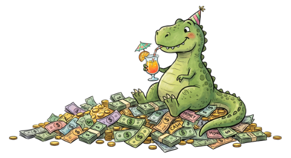

אם הייתם שואלים אותי לפני כמה שנים איפה אני רואה את עצמי בגיל 25 בטח הייתי אומרת לפחות אחד מהדברים הבאים:
1. תהיה לי דירה משלי
2. אני אתחתן או אהיה לקראת חתונה
3. אני אהיה בתחילת הקריירה שלי ותהיה לי עבודה מסודרת
4. אני אמצא תרופה לסרטן, אשתתף במרתונים, אתכנן אלגוריתמים מורכבים ואמצא פתרון להתחממות הגלובלית וגם יהיה לי פנטהאוז

מלבד סעיף 4, שאולי קצת יותר מדי שאפתני, כשאני רואה את שאר הסעיפים אני מאוכזבת. 
סעיפים 1 ו-3 הם הסעיפים שחתרתי אליהם הכי הרבה, ולמרות זאת לא הצלחתי להגיע אל המטרה.

על חלום הדירה בישראל ויתרתי. למרות שיש לי הון עצמי נחמד שהשגתי בזיעת אפיי, אני יודעת שזה עדיין רחוק מלגור בדירה משלי במרכז או להשקיע בדירה בפריפריה כדי להקרע תחת המשכנתא.

מסעיף 3 אני הכי מאוכזבת, השלמתי מה שנקרא תואר "נחשב"- תואר במדעי המחשב שהתחלתי אותו באוקטובר 2022 כשהשוק היה קשה אבל סביר רק כדי שבסיום התואר אני אגלה שהתואר שלי נחוץ בדיוק כמו תואר בחקר עשבים שוטים בגינות כלבים (יש שם דשא סינטטי בכלל).

במקום זה, אני מוצאת את עצמי בין עבודות זמניות, מרוויחה דמי כיס, עובדת ליליות וימים כולל סופי שבוע וחגים כדי שהמשכורת תועיל לי לפחות במקצת.

זה השלב בחיים שבו אני תוהה האם הבחירות שלי היו טובות – הבחירה שלי בתואר, הבחירה לעבוד וללמוד במקום לטייל בעולם, הבחירה להתמקד במטרות מסוימות ולהזניח אחרות. ולפעמים אני תוהה על כך שאולי זה חלק מהתהליך, ואם אמשיך להתמיד אני אגשים את כל המטרות והחלומות שלי. ותקופת הסבל של עכשיו היא עוד לבנה שבונה את פנטהאוז 5 החדרים במרכז הארץ של העתיד שלי.

ואז אני פותחת את הרשת הבריונית המכונה "לינקדאין" ומגלה שיש ילדה בת 20 שעובדת בתפקיד מתקדם בחברת סייבר, עוד מילואמניק שקיבל הצטיינות דיקן מהאוניברסיטה תוך כדי שהוא עובד בחברת מייקרוסופט, סטודנטית במסלול מצטיינים שילדה לא מזמן וחתמה על חוזה עבודה בחברת פינטק. ולקינוח, קונקשין שמכריז שהתחיל את דרכו החדשה בתפקיד הראשון שלו כמפתח בינה מלאכותית עם התמחות בלהיות מנכ''ל שמוצא תרופה לסרטן שגם משתתף במרתונים, מתכנן אלגוריתמים מורכבים ומוצא פתרון להתחממות הגלובלית.

ואז אני פותחת את הרשת הבריונית השנייה המכונה "אינסטגרם" ומגלה שכל חבריי ומכריי שותים, נופשים, חוגגים ומערימים קלוריות בעגלת קפה פנסית ביום שבת בזמן שאני טוחנת עוד משמרת.

איך אמר סדריק? *החיים יפים כשאתה בן 8.* אבל אני אדייק אותו לאמצע שנות ה-20.

ואז אני נכנסת לרשת הפחות בריונית המכונה "פייסבוק" וקוראת פוסטים של בני 23 עם הון עצמי של 600 אלף שקל או בני 27 עם דירת 4 חדרים במרכז מתייעצים האם נכון לשים השקעה של 500 אלף שקל על סנופי או על נסדק.
ועכשיו גם נהיה טרנד לכתוב את הגיל שלך (בדרך כלל בין 20 ל-26) בצירוף השאלה האם 180 אלף שקל בפנסיה זה מקור לדאגה?

ושוב אני חוזרת לתהות האם הבחירות שלי היו נכנות ולמה לא קניתי דירה בזמן שהייתי בצ'יל ברחם של אמא שלי או למה לא בחרתי להיוולד למשפחה עשירה כאילו יש לי שליטה על זה.

אני יודעת מה תחשבו - ברשתות החברתיות כל ההצלחות והחוויות מוצגות בצורה חיובית מוקצנת ואת לא יודעת מה באמת קורה מאחורי הקלעים, ואני אגיד לכם שאתם צודקים.
עם זאת, גם ביחס לסביבה הפיזית שלי אני מרגישה שיחסית לאחרים אני פחות מוצלחת.
כי כל הזמן יש עוד מי שהתארסה, עוד מישהי שהתחתנה, עוד מישהי או מישהו שמצאו את אהבת חייהם, חברים שעובדים בעבודה רצינית אמיתית שמאתגרת אותם או חברים עם שאיפות מוגדרות בחיים כמו "אני רוצה להיות רופא" ושועטים אל עבר המטרה. בקיצור, כולם התקדמו שלב בחיים חוץ ממני.

אני יודעת שהשוואות הן דבר רעיל וכל מנטור מתחיל יאמר לכם לשחרר את ההשוואות לאחרים ולהשוות את עצמך ביחס לעצמך.

וכשאני עושה את זה, אני נהיית קצת יותר אופטימית. ואני אפילו לא צריכה להרחיק לכת. למשל מי שהייתי לפני שנתיים זאת לא לגמרי מי שאני היום. המון דעות, העדפות ורצונות השתנו מאז וזה מה שמוכיח שהשתנתי או התפתחתי.
החוויות שעברתי במהלך השנים עיצבו אותי ושכללו כל מיני יכולות שעד תחילת שנות ה-20 לא האמנתי שאני יכולה להתנהג, לחשוב או להעדיף אחרת.
האמת שרק בשנה האחרונה אני יכולה להצביע על כמה היבטים בחיי שהשתנו מקצה לקצה. אולי הפריצה האמיתית שלי מתחילה רק עכשיו?

קרדיט לג'ימיני על ג'ינרוט התמונה

---

