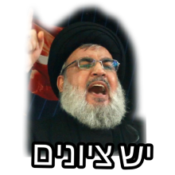

### ומצמד מילים אחד פחדתי יותר מכל:

### יש ציונים!

---

ברוב שנות לימודיי בבית הספר, החיים שלי סבבו סביב ציונים. בראשי, ציון היה מה שמגדיר אותי.
אם קיבלתי 70 זה לא רק אומר שלא למדתי מספיק טוב- זה אומר שאני טיפשה, שאני מטומטמת ושלא יצא ממני כלום בחיים.
האמנתי בכל ליבי שהציון שקיבלתי זה הדירוג לאדם שאני, לאישיות שלי ולפוטנציאל שלי.

---

*"סיימתי לבדוק את המבחנים שלכם"*

המשפט שאחריו הלב שלי התחיל לפעום מהר וחזק יותר, הלסת התחילה קצת לרעוד והחרדה התפשטה מבית החזה אל שאר הגוף.

---

מה שעוד יותר הקשה עליי, היה שלא התברכתי במוח איינשטיין וכדי להוציא הישגים שהם מעבר לבינוניים נדרשתי ללמוד הרבה וקשה מאוד.
אני חושבת שרמת החרשנות לי עקפה כל תלמיד אפשרי שיצא לי להכיר.
בחמש יחידות מתמטיקה פתרתי את כל הבגרויות של העשור האחרון אם לא יותר, את כל ספר יואל גבע ואת כל ספר ארכימדס ועדיין לא הרגשתי מוכנה.
אני חושבת שכל אדם ממוצע שהיה לו את אותה מוטיבציה כמוני ללמוד כל כך הרבה, היה מוציא ציונים יותר טובים ממני.

למרות שחרשתי הרבה, עדיין היו שנים שהייתי מסיימת עם אות הקלון "תעודת שקדנות". מעמד שאמור להיות מפרגן הרגיש יותר כמו בושה. דווקא בגלל שהתאמצתי כל כך הרבה. רק חשבתי יותר שהצטיינות היא נחלת המחוננים בלבד ואני לא חלק מהקבוצה הזאת.

## המתנה הסובייטית

אני מאשימה את חינוך בעדה שלי בשריטה הזאת.
לקבל ציון שלא נחשב טוב (זה יכל להיות גם פחות מ90) היה שווה ערך לפשע. לפחות זאת החוויה שהרגשתי בגיל מוקדם יותר.

אני לא אפרט פה על שיטת החינוך, אתם יכולים להסיק לבד. אני רק אציין **שלעשות טעות הרגיש כמו לעשות פשע**.
אני מדברת על טעויות בשיעורי בית ובמבחנים. אשכרה הרגשתי שאני פשוט חרא בנאדם כי לא ידעתי איך לפתור תרגיל או כי לא ידעתי תרגום של מילה באנגלית.

אחרי בית הספר בארוחת הצהריים, בימים שסבתא הייתה גרה איתי, היא הייתה מספרת לי שבימים שלה, התלמידים שכולם נידו אותם היו התלמידים שקיבלו את הציונים הנמוכים והתלמידים המקובלים היו המצטיינים.

כמו שהמצטיינים בלימודים היו מודל שסבתא שלי כל הזמן דיברה עליו, גם אני הסתכלתי עליהם ורציתי להיות כמוהם.
הילדים האלה שמוציאים מאה או קרוב לזה בכל מבחן, אלה שהממוצע שלהם תמיד מעל 95. היה נראה שהם גם לא לומדים קשה כמוני, היה להם זכרון משובח וכנראה חלקם גם מחוננים, היה נראה שדברים באו להם יותר בקלות.
כל כך רציתי להיות כזאת כי ההורים שלי רצו שאני אהיה כזאת ורציתי שהם יהיו מרוצים ממני.

עם השנים, בתיכון, להורים שלי ולסבתא שלי היה פחות איכפת עם איזה ציון אני נכנסת הביתה. אבל בכל זאת החרדה מציונים נשארה ואף החמירה.
בתקופה הזאת ידעתי שהציונים באמת בעלי משמעות כי הם מרכיבים את תעודת הבגרות שלי.

---

*"עכשיו אחלק את המבחנים"*

ברגע הזה הלב פעם מהר יותר והגוף שלי רעד.
כשקראו בשם שלי הייתי לוקחת את המבחן מקופל ולפעמים לא הייתי בודקת כמה קיבלתי כמה ימים קדימה, לפעמים אפילו לא הייתי יודעת מה הציון עד סוף השנה.

המורים שחתמו עם ציון את המבחנים שלי לא תיארו כמה השפעה יש למספר הזה שהם רושמים על הדף.

I know, זה נשמע מאוד לא בריא.
אבל זה היה חלק גדול מהחיים שלי.

---

### מה גרם לשינוי שלי

כל החיים שלי לימדו אותי שמי שמקבל ציונים לא טובים בבית הספר נהיה בסוף מנקה רחובות עני (זה אירוני כי עכשיו מנקי רחובות הם אנשים שלא ישארו מובטלים בזמן הקרוב לעומת, אהמ, מתכנתים ומהנדסים)
ובלי קשר לזה, ראיתי אנשים שמצליחים בחיים גם בלי להיות מוצלחים בבית הספר, אנשים מוכשרים ומעניינים.

הבנתי שציון לא מודד ערך. ציון מודד ביצועים במשימה מאוד מסוימת, ברגע מאוד מסוים. הוא לא מודד יצירתיות, סקרנות, התמדה, מוטיבציה, בטחון עצמי וחכמת חיים.

ציונים גורמים להשוואות לא בריאות בין אנשים. כמה אנשים אני מכירה שקיבלו ציונים טובים כי רימו במבחן או כי היו להם תנאים מקלים יותר שלא היו מוצדקים? המון.

רק בתואר הבנתי סוף סוף שציון לא מדרג את האדם שאני.

עם הציונים שלי בתואר, שהם הרבה יותר חשובים מאיזו מתכונת במתמטיקה, אני מחכה בקוצר רוח ומסתכלת ברגע שהם עולים. והקטע הכי מדהים שהם יכולים להיות יותר נמוכים ממידת הנעליים שלי :)

בגלל שהייתי מאוד חרשנית בבית הספר וגם בתואר ועדיין לא תמיד הייתי מקבלת ציונים טובים, הבנתי שכבר לא הגיוני להסיק ממספר אחד אם אני חכמה, עצלנית או בעלת פוטנציאל. הציון יכול להגיד איך הלך לי במבחן אבל הוא בשום אופן לא יכול להגיד מי אני.

---

