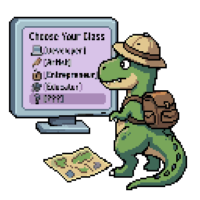

אם יצא לכם לקרוא את [הפוסט הראשון](https://digital-thoughts2d.github.io/My-Blog/blog/first-post/) שלי כאן בבלוג, בטח שמתם לב לקנאה שלי כלפי אנשים שיש להם שאיפה מוגדרת והם שועטים אל עבר המטרות שלהם.
יש משהו גדול מאוד שהבנתי בשנה האחרונה והוא **הצורך בהגדרת תכלית והידיעה מה באמת חשוב לך בחיים**.
ואת התובנה הזאת השגתי אחרי לא מעט תסכול והתפזרות.

לחפש את התכלית שלך זה כמו להשיג נקודות XP ובעזרתן לשדרג את הדמות שלך.
להגשים את התכלית זה כמו להביס את הבוס הגדול.

אחרי יותר מחצי שנה שהגשתי קורות חיים לכל מיני תפקידים של עבודה של מבוגרים (aka עבודה רצינית) וכל מה שקיבלתי במקרה הטוב זה "תודה על ההגשה אבל בחרנו להמשיך עם מועמדים אחרים", ובמקרים פחות טובים זכיתי להתעלמות, ובמקרים הגרועים זה "לכי תבכי בפינה. אה ואת גם לוזרית וגם מכוערת". טוב, אולי את האחרון המצאתי אבל ככה פחות או יותר זה מרגיש לחפש עבודה בתחום ההיייטק בימינו כשאין לך ניסיון כלל בתעשייה.

ואז כל מיני פרסומים של קורסים מצאו את דרכם אליי.
הקורסים הראשונים שהגשתי אליהם פרטים היו בתחומים שקשורים לתואר שלי כמו סייבר, בינה מלאכותית ואפילו דאטה אנליסט. קצת חששתי מלהתקע בכיוון אחד- אם אני עושה קורס סייבר זה אומר שעכשיו אני צריכה להשקיע את כל מאמציי במציאת משרה בסייבר וזה אומר ששאר התחומים יורדים מהפרק. ומה אם יש תחום שיעניין אותי יותר? FOMO. אבל הסיבה הכי משמעותית שבגינה לא נרשמתי לקורסים האלה היא בגלל שיש סיכוי לא נמוך שגם אז לא תהיה לי עבודה כי ניסיון זה מה שחשוב. אבל את הקיטור על זה אני שומרת לפוסט אחר.

אחרי כל הדחיות עלו לי שאלות האם התענוג הזה בשבילי ואולי נבראתי לעשות משהו אחר בעולם.
יום אחד פגשתי מישהי בעבודה שלי שמעט קטנה ממני בגיל והכרתי אותה מהיסודי, היא עובדת בהנהלת חשבונות בחברה ששתינו עובדות בה.
היא סיפרה לי שהיא עשתה קורס של שנה בהנהלת חשבונות ואז חשבתי לעצמי שזה יהיה מגניב לעשות את זה גם רק בשביל להחליף טייטל לעבודה של מבוגרים. אז יצרתי קשר עם מכללה מובילה בתחום. כשסיפרתי על זה להוריי, הם כצפוי לא תמכו בהחלטה ואבא שלי אפילו התבייש בזה: "הבת שלי תעבוד בעבודה של שלוש יחידות".
בסוף ירדתי מההחלטה. לא בגלל ההשפעה מההורים אלא בגלל שזה כנראה באמת הולך לשעמם אותי וההשכלה של קורס בלבד לא תאפשר לי להתקדם בתפקיד, מה שמשאיר אותי משועממת עם משכורת שלא מספיקה לחמצוצים.

התחלתי להגיש קורות חיים לכל מיני משרות בק אופיס בחברות ביטוח כי שמעתי שזה יכול להתאים לי. כל אלה שחזרו אליי הציעו לי שכר מאוד נמוך אבל בכל זאת התעניינתי באחת מהמשרות והגעתי לראיון. למרות שלא ממש התלהבתי מהתפקיד, המשכתי לשאול אותם שאלות יותר עמוקות על העבודה והמון שאלות בסגנון של איך להצליח בתפקיד ואיך להתקדם. ניסיתי להבין האם העבודה הזאת תיתן לי כלים, תהיה לי מעניינת ותתן לי מוטיבציה להצליח בעזרת אופק התקדמות או בונוסים כספיים (התשובה היא לא). לאחר כמה ימים קיבלתי הודעה למייל שהם ממשיכים עם מועמדים אחרים.

**אז מה את רוצה לעשות כשתיהי גדולה?**

כבר מגיל תיכון ידעתי שהתכלית שלי בחיים תהיה לעזור לאנשים אחרים. בתקופת התיכון היו לי שאיפות מאוד גדולות- לגרום לחרשים לשמוע, לעיוורים לראות ולפיסחים ללכת. עם הזמן הבנתי שעזרה יכולה לבוא בהמון דרכים. למשל, כשאני קוראת פוסט של מישהו שנותן לי ידע פרקטי, כשאני שומעת פודקאסט, כשאני קוראת ספר, כשאני נהנת משיר או כשאני נעזרת באפליקציה- יש מישהו שהיה אחראי ליצירה הזאת וזה גורם לי להנאה או מקל לי על החיים.
ומה שאני צריכה לעשות זה **למצוא את הדרך שבה אני רוצה לתת מעצמי לאחרים**.
ויש לי שני תחומים מאוד משמעותיים שאני מרגישה איתם בנוח לתרום לעולם - יצירה והפצת ידע.

וזה לא מפתיע שבמשך שנתיים אני מתעסקת בפיתוח משחקים שיקומיים. אפשר לומר שזה השילוב המושלם של התואר שלי ביחד עם חוש יצירתי ועזרה לזולת.

היי אז מצאתי את היעוד שלי?
אני לא בטוחה לגבי זה עדיין. משהו מרגיש לי לא שלם גם עם העיסוק הזה.
להקים רק משחק אחד זה פרוייקט ענק גם עם עזרה מבינה מלאכותית וכדי להוציא אותו בזמן סביר צריך צוות של אנשים.
הגשתי קורות חיים להמון חברות שעוסקות בתחום הזה או במשהו קרוב. שלחתי דרך האתרים, פניתי במיילים, שלחתי קונקשינים למגייסות עם בקשה אישית ופעם אחת אפילו שלחתי מייל ישירות למנכ''ל. אף אחד מהם לא חזר אליי חוץ מהאחרון שהוא סטרטאפ מאוד קטן שלא מחפש עובדים.

רגע, אולי הדרך היחידה שמובילה אותי אל הפתרון היא להקים את העסק הזה בעצמי?
אבל גם אז משהו מרגיש לי לא שלם. השכל אומר שאני צריכה קודם לעבוד בחברה בתור שכירה כדי להבין איך דברים עובדים מבפנים. אבל אז אני שוב נכנסת לאותו הלופ של למצוא משרה בתחום **->** אף אחד לא נותן לי הזדמנות **->** לבכות **->** לחפש את עצמי מחדש.

נקודה נוספת היא שאני לא מצליחה למצוא נושא שבוער בי שעליו יקום העסק הזה (למשל יש חברה שעוזרת לאנשים שעברו טראומה מוחית וזה הנושא שלה) ויש גם את כל המורכבויות עצמן בלהקים עסק כמו לעשות סקר שוק, לגייס שותפים, למצוא משקיעים וכל זה...
מודה שאני קצת עצלנית, אבל אולי העצלות שלי נובעת מהידיעה שהשאיפה הזאת לא ממש בשלה אצלי מהסיבות שמניתי.

יש עוד כיוון שחשבתי עליו והוא להיות מקעקעת כי יש לי כישרון טבעי בציור והסגנון שלי מאוד מתאים לעיסוק הזה. ואני דיי בטוחה שאני יכולה להיות טובה בזה אחרי שהתנסתי קצת בציור בחריטות.
אבל אני לא בטוחה כמה אני ארצה לעסוק בזה בעוד חמש שנים, או מה יקרה אם לא תהיה לי מוזה לצייר? או אם אפשל בחריטה על עור של מישהו?

ברור לי שכל התקדמות בחיים כרוכה בלקיחת סיכון. וברור שכל נתיב שאקח יפסול לי  אוטומטית נתיבים אחרים בדרך.
ואני כל כך משתוקקת לבחור בנתיב שאני ארגיש הכי בטוחה בעצמי כשאלך בדרכו. גם אם יהיה קשה וגם עם ים של אתגרים, ידיעת התכלית שלי ודבקות בה תעזור לי להתמודד עם כל הקשיים האלה. אם לא אהיה נעולה במאת האחוזים על המטרה שלי, אני לא אצליח להתמודד בהצלחה עם הקשיים שיפגשו אותי בדרך.

אבל בינתיים, אני ממשיכה לשבת על הגדר, מנסה לפענח לאן נושבת הרוח בעידן הזה, להתבאס שאני נשארת באותו המקום ולהרגיש שאני לא ממצה את עצמי.

קרדיט ל[pixellab](https://www.pixellab.ai/) על ג'ינרוט התמונה

---

