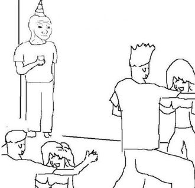

את [הפוסט הראשון](https://digital-thoughts2d.github.io/My-Blog/blog/first-post/) חתמתי באמירה אופטימית.
אז אחרי שני פוסטים של פריקת תסכול, החלטתי שיהיה נכון הפעם להתייחס לחלק האופטימי של הפוסט הראשון.

בפוסט הזה רציתי לדבר על כמה תחומים בחיים שלי שהיו חלק מהגדרת הזהות שלי והשתנו בשנים האחרונות.
הבנתי שיש לי המון מה לכתוב לגבי כל תחום, לכן החלטתי לפצל את הפוסטים ובכל פוסט להרחיב על תחום אחד שהשתנה בחיים שלי.

אני אדבר על איך מחוסר בטחון בסיטואציות חברתיות נהיה לי מיינדסט של "אני הולכת להסתדר גם אם יפילו אותי בתוך ישיבה של נהוראים". אני אכתוב פה גם טיפים פרקטיים שעזרו לי.

---

בתקופת בית הספר, דווקא החופש הגדול הייתה התקופה הכי קשה בשבילי. כי בתקופה הזאת הרגשתי בודדה יותר מבדרך כלל.
בתיכון הנושא החברתי העסיק אותי הכי הרבה והיה המקור העיקרי למצבי רוח ירודים (ואולי גם דיכאונות).
הדבר הכי משמעותי שאני זוכרת מהטיול השנתי של כיתה יב היה שבכיתי באוטובוס בדרך לפארק תמנע כי אף חברה לא ישבה לידי באוטובוס לאורך הטיול.
בפורים של כיתה יב לא נכחתי כי חשבתי שלא יהיה לי עם להסתובב כל היום ורציתי לחסוך מעצמי את הכאב הזה.
העיניין הוא שכן היו לי חברים אבל זה לא הרגיש כל כך מבטיח. עדיין היו הרבה הפסקות שמצאתי את עצמי לבד עם הטלפון.

אני פשוט אינטרוברטית (מופנמת) אמרתי לעצמי ועם הזהות הזאת המשכתי לחיות.

מועדון ומסיבה היו המילים שהכי פחדתי מהן. כשנאלצתי ללכת למסיבה במועדון (כשהוזמנתי לימי הולדת ואירועים כי מרצוני לא הייתי מוכנה ללכת בחיים) הייתי מאוד חרדה ופחדתי לרקוד. הייתי נשארת בצד של הרחבה ומקווה שאף אחד לא ישים לב אליי, סופרת את הזמן לאחור עד שהאירוע יסתיים ויהיה אפשר לצאת מהמרחב המוגן.

גם אחרי הצבא אירועים חברתיים לא היו הדבר שהכי ציפיתי לו, זה היה לי קצת יותר קל אבל עדיין הייתי תמיד האדם השקט של החבורה. באותה תקופה עבדתי במשרה מלאה במקום עבודה אחד עד תחילת התואר, אני זוכרת ששם אנשים סיפרו לי שהרושם הראשוני שלהם כלפיי היה שאני ביישנית, לא מתקשרת ושלא אשרוד המון זמן בעבודה אבל הם הודו שטעו ושהפתעתי אותם.

אולי זה ישמע סותר אבל מעולם לא היה לי פחד קהל. כשהייתי קטנה, הייתי חמש שנים בחוג תיאטרון ולא פחדתי לעלות על במות וגם להתחנן לתפקידים ראשיים.
אני זוכרת שבאחד ממופעי סוף שנה, המארגנים הזמינו ליצן שיעביר פעילות לכל המשפחות והוא זימן לבמה שני נציגים. לא ידעתי אפילו מה הוא רוצה לעשות אבל הרמתי את היד וביקשתי לבוא, הוא נתן לי ולעוד ילד שעלה יחד איתי לבמה ספוג אדום של ליצנים לשים על האף ואמר לנו "תאלתרו" וכך עמדנו מול יותר ממאה איש ואלתרנו. אני לא זוכרת במדויק מה אלתרנו אבל אני זוכרת שלא הרגשתי מבוכה ודווקא אהבתי את הבמה.

ידעתי שאין לי הרבה ביישנות, הבעיה שלי בסיטואציות חברתיות ככל הנראה הייתה חוסר בבטחון עצמי.

**מה גרם לי להשתפר**

אני חושבת שהתפנית שלי קרתה בזכות שני גורמים:
1. התבגרות - עם ההתבגרות אנחנו צוברים ניסיון בכל מיני תחומים וכך אנחנו מרגישים בטוחים יותר עם עצמנו ויש לזה גם השפעה בתחום החברתי.
2. שמתי את עצמי בתוך סיטואציות חברתיות.

אני הולכת לדבר על 2, כי עליו יש לנו המון שליטה.

לפני שהשנה השנייה שלי בתואר התחילה, ראיתי פרסום של מלגה לסטודנטים שבמסגרתה יש פעילויות שקשורות ליהדות, התנדבות וטיול מאורגן לירושלים. אני אדם דיי זהיר ומעט חששתי להרשם כי אני לא יודעת מה מצפה לי ואיך זה ישתלב בלימודים.

לונג סטורי שורט - זאת הייתה בין ההחלטות הספונטיניות שלי הכי טובות שעשיתי.
פעם בשבוע הייתי מגיעה למפגש עם עוד סטודנטים שלא הכרתי ממוסדות שונים, שם היו הרצאות, קבוצות ומעגלי שיח.
מאוד נהנתי גם מהתוכן וגם מחברת הסטודנטים והמנחים (וזה למרות שאין לי קרבה לדת). במסגרת הזאת הכרתי חברות, נהיינו חבורה שהמשיכה להפגש גם מחוץ לשעות המלגה. המשכתי עוד שנה את המלגה ובשנה השלישית אני והחברות נרשמנו למלגה אחרת בתחום כי לא יכולנו להמשיך לשנה שלישית ברצף באותו מקום.
ככה יצא שבמשך שלוש שנים חשפתי את עצמי לפחות פעם בשבוע לחבר'ה שונים בסביבות הגיל שלי עם סטטוס דומה לשלי, נהיו לי חברויות חדשות והחיים שלי נהיו קצת פחות משעממים.
האמת שקשה לי לראות את עצמי בלי מסגרת כזאת אחרי שאסיים את הלימודים.

עוד משהו שהקפיץ לי את הבטחון החברתי זאת העבודה שלי.
בעבודה שלי יש המון משמעות לעם איזה אנשים אני מבלה את המשמרת כי אנחנו סוג של עובדים כצוות.
זה תלוי בסוג המשמרת, אנחנו יכולים להיות בין שניים לחמישה אנשים, מה שמאפשר לתקשר אחד עם השני. גם בעבודה האנשים הם בגילי.
בגלל שבדרך כלל מבלים המון שעות בעבודה - חשוב שתהיה לכם סביבה חברתית שתוכלו לתקשר בה ולתרגל את היכולות החברתיות שלכם כמה שרק אפשר.
מבחינתי צוות טוב של אנשים זה הדבר הכי חשוב במקום עבודה.

כל מה שאמרתי יכול לעזור אבל אם אתם מוצאים את עצמכם גוללים בטלפון בפינת החדר במפגשים חברתיים **ורוצים להיות בתקשורת עם אנשים** ולא רק להקשיב להם מהצד, חשוב שתשימו לב לדברים הבאים:

**1. הקשבה**

תהיו המקשיבים. כשאתם מקשיבים למישהו אחר, אתם נותנים לו להרגיש בנוח איתכם ואתם גם נותנים לעצמכם יתרון בכך שיש לכם מידע על הצד השני. אתם יכולים להשתמש במידע הזה בכך שתביעו הזדהות, תשאלו שאלות או תתמכו, בהתאם לסיטואציה.

**2. תתעניינו**

אם הקשבתם, וודאי תצליחו לחשוב על שאלות שתוכלו לשאול את הצד השני. בדרך כלל כששואלים אתכם שאלה כמו "מה את הכי אוהבת לאכול?" תענו עליה ותחזירו את אותה שאלה לצד השני, כך הצד השני מרגיש שמתעניינים בו.

**3. תתמקדו ברגש**

כשאנחנו מתחילים ליצור אינטרקציה ראשונית עם בן אדם, הוא בדרך כלל יספר לנו מה הוא עושה בחיים.
למשל, סטודנט שיספר לכם איזה תואר הוא עושה.
תשאלו אותו שאלות קצת עמוקות כמו "למה בחרת את התואר הזה?", "מה מושך אותך בתחום?", "למה התחלת להתעניין בזה?" כך אתם גורמים לאדם השני להפתח בפניכם, וכשאדם נפתח אליכם הוא מרגיש איתכם יותר בנוח. זה גם מספק לכם עוד חומר לשאילת שאלות או לפתיחת דיון נוסף.

**4. להצטרף לדיון**

כמובן שהכל במסגרת הטקט. אבל אם מתפתח דיון בקבוצה שאתם נמצאים בה, למשל בעבודה, אל תתביישו להצטרף לדיון הזה אם יש לכם משהו להוסיף. 

**5. לגשת לאנשים**

במיוחד אם אתם בכנס או במסיבה עם המון אנשים שאתם לא מכירים, אל תחששו לגשת אל אדם שמעניין אתכם ולפתוח איתו שיחה.
כל מי שכבר נמצא בסיטואציה המונית מוכן לכך שמישהו ייגש אליו. אל תחששו, אתם לא מפריעים לאותו אדם כל עוד הוא לא בעיסוק אחר.
אם תעשו את זה בצורה נעימה ותשתמשו בסעיפים הקודמים, יש סיכוי טוב שאותו אדם ירגיש בנוח עם זה שפניתם אליו וישמח לשוחח איתכם.

**6. תשתפו**

אל תתביישו לחשוף לצד השני גם את החולשות שלכם. אני חלילה לא אומרת לכם לעשות לו  trauma dumping, אבל ברוב המוחלט של השיחות בטוח תוכלו לספר מה משמח אתכם, מה מעציב אתכם, ממה אתם חרדים ומה אתם אוהבים בלי שזה ירגיש כמו מעמסה כלפי האדם שאתם משוחחים איתו.
כשאנחנו חושפים את עצמנו רגשית למישהו אחר, זה נותן לצד השני בטחון והוא יחשוף גם את עצמו.
בני אדם הם יצורים של רגש, לכן תקשורת רגשית היא מה שהכי מקרב לבבות.

**7. לשנות תפיסה**

אנחנו זה הסיפור שאנחנו מספרים לעצמנו. כשהתחלתי להבין שאני כן אדם מעניין ואני כן יודעת לתקשר עם אנשים, מתפיסה של "אני טיפוס מופנם ובגלל זה קשה לי" התחלתי להגיד לעצמי "אני אדם חברותי. אני אוהבת להכיר אנשים חדשים ואני אסתדר בכל סיטואציה חברתית".
כשאני באמת ובתמים מאמינה בסיפור החדש שלי, אני גם פועלת לפיו.

---

אם הדברים שכתבתי למעלה ישמעו מאוד בנאליים לפחות לחצי מהאוכלוסיה, זה סימן טוב! זה אומר שאולי עליתי על הדרך הנכונה.
הטיפים האלה מוקדשים למי שחושש מסיטואציות חברתיות, למי שמוצא את עצמו בפינה ולא מרגיש חלק אבל **משתוקק**  להרגיש חלק, למי שקשה לו להחזיק שיחה ספונטנית עם אדם שלא נמצא איתו בקשר קרוב אבל היה רוצה להצליח, למי שהיה רוצה להרגיש יותר משולב בחבורה.

הטיפים שנתתי הם לא טיפים שקראתי באינטרנט או הוצאתי מתוך פודקאסט. יש סיכוי סביר שכולם או חלקם באמת נאמרו באיזושהי פלטפורמה.
זיקקתי את הנקודות האלה אחרי שראיתי שמשהו בחיים החברתיים שלי השתנה, שהבטחון שלי בסיטואציות חברתיות עלה ושנהיה לי קל יותר בתקשורת בינאישת. לכן אלה טיפים מאוד פרקטיים.

חשוב לי להדגיש שלהיות אדם מופנם זה לא דבר רע. ואם אתם מופנמים אל תחשבו שאתם צריכים להשתנות רק כי בחברה שלנו זאת נחשבת לתכונה רעה!
מופנמות היא לא חרדה חברתית, אתם יכולים להיות מופנמים ועדיין להיות טיפוסים שנהנים במפגשים חברתיים ולמשוך אליכם קשרים.

אם הייתם אומרים לי לפני שנתיים או יותר, שהייתי רושמת פוסט כזה, לא הייתי מאמינה לכם.
להיות "הצל" של החבורה, להיות האדם השקט בחדר, היה חלק גדול מהחיים שלי.
יש לי עוד הרבה מה לעבוד עליו ולהשתפר בו, אבל מכאן זה רק לדחוף את עצמי לתוך סיטואציות חברתיות ולנסות לעשות דברים יותר נועזים כמו לגשת ליותר אנשים שאני לא מכירה, להשתתף בדיונים, והכי חשוב - להאמין שאני מעניינת ואני אמשוך אליי את הקשרים הנכונים.

---

